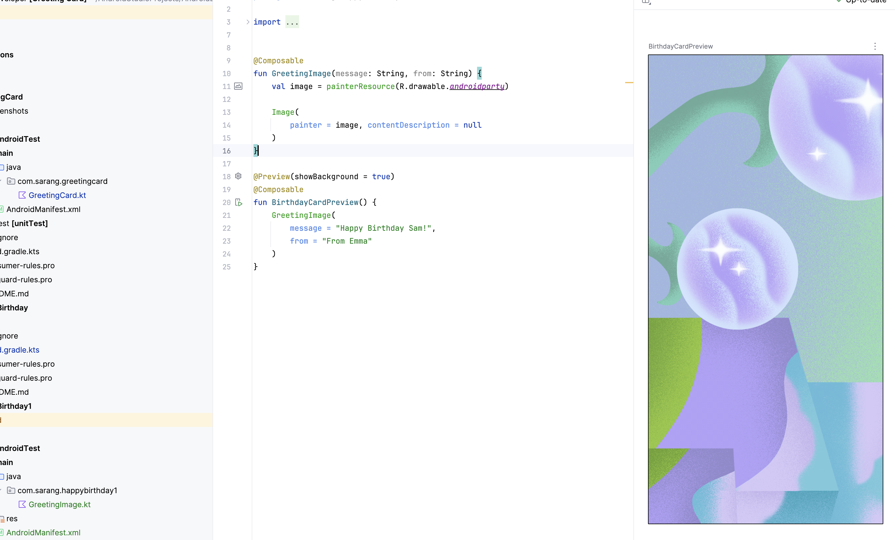
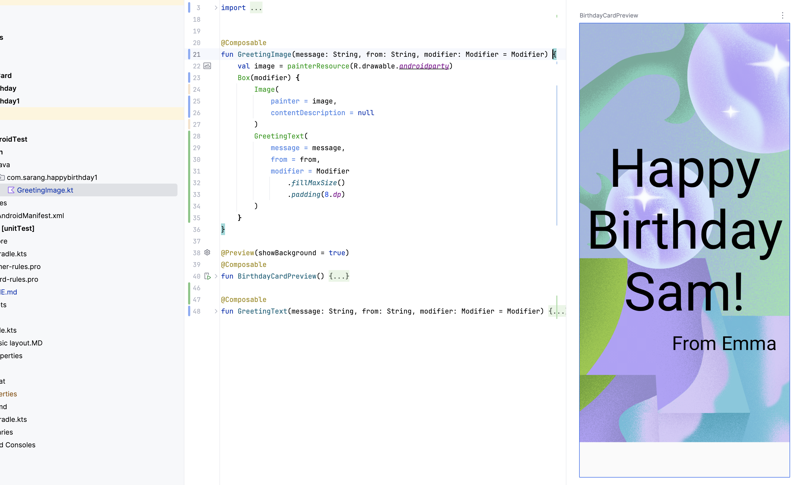

# [4 Add images to your Android app](https://developer.android.com/codelabs/basic-android-kotlin-compose-add-images?continue=https%3A%2F%2Fdeveloper.android.com%2Fcourses%2Fpathways%2Fandroid-basics-compose-unit-1-pathway-3%23codelab-https%3A%2F%2Fdeveloper.android.com%2Fcodelabs%2Fbasic-android-kotlin-compose-add-images#0)

## [1. Before you begin](https://developer.android.com/codelabs/basic-android-kotlin-compose-add-images?continue=https%3A%2F%2Fdeveloper.android.com%2Fcourses%2Fpathways%2Fandroid-basics-compose-unit-1-pathway-3%23codelab-https%3A%2F%2Fdeveloper.android.com%2Fcodelabs%2Fbasic-android-kotlin-compose-add-images#0)

```
Prerequisites
- 안드로이드 스튜디오로 앱 생성과 실행 방법.
- composable UI 요소들 추가 방법 

What you'll learn
- 이미지, 사진 추가.
- Image composable로 이미지 표시.
- String 리소스 사용 모범 사례

What you'll build
- 생일 축하 앱에 이미지 추가

What you'll need
- 안드로이드 스튜디오
- 이전에 만든 생일축하 앱 앱
```

## [2. Set up your app](https://developer.android.com/codelabs/basic-android-kotlin-compose-add-images?continue=https%3A%2F%2Fdeveloper.android.com%2Fcourses%2Fpathways%2Fandroid-basics-compose-unit-1-pathway-3%23codelab-https%3A%2F%2Fdeveloper.android.com%2Fcodelabs%2Fbasic-android-kotlin-compose-add-images#1)

```
이미지 다운로드

View > Tool Windows > Resource Manager -> Import Drawables

1인치에 (2.54cm)에 160 픽셀인 기기도 있고 460인 기기도 있음.
이를 고려하지 않고 이미지를 만들면, 이미지가 확대되 흐려보이거나, 너무 큰 이미지라 메모리 사용을 많이 하는 등 적합하지 않게 로드 한다.

```

## [3. Add an Image composable](https://developer.android.com/codelabs/basic-android-kotlin-compose-add-images?continue=https%3A%2F%2Fdeveloper.android.com%2Fcourses%2Fpathways%2Fandroid-basics-compose-unit-1-pathway-3%23codelab-https%3A%2F%2Fdeveloper.android.com%2Fcodelabs%2Fbasic-android-kotlin-compose-add-images#2)

```
Image composable를 사용하여 이미지 표시 가능.

Add a composable function to add an image

@Composable
fun GreetingImage(message: String, from: String, modifier: Modifier = Modifier) {
}

모든 Composable 함수는 Modifier을 파라미터로 넣는걸 권장.


Resources in Jetpack Compose

Resources란 추가적인 파일들, 정적인 컨텐츠, 비트맵/문구와 같은.

앱코드와 분리해 독립적으로 관리해야 다양한 폰에따라 다른 리소스를 적용할 수 있다.

화면의 크기나 언어에 따라 같은 화면이라도 사용하는 리소스가 달라질 수 있음.


Grouping resources

res의 하위 폴더에 리소스를 관리.

mipmap 은 lunch icon을 위한 폴더

추가한 리소스는 R 클래스에 리소스 ID가 등록되어 코드에서 접근 가능. 

R.drawable.graphic
[자동생성클래스].[폴더명].[파일명]

val image = painterResource(R.drawable.androidparty)

Image는 contentDescription를 설정해 줘야함. 접근성을 위한 talkback에 사용될 수 있음.

```



## [4. Add Box layout](https://developer.android.com/codelabs/basic-android-kotlin-compose-add-images?continue=https%3A%2F%2Fdeveloper.android.com%2Fcourses%2Fpathways%2Fandroid-basics-compose-unit-1-pathway-3%23codelab-https%3A%2F%2Fdeveloper.android.com%2Fcodelabs%2Fbasic-android-kotlin-compose-add-images#3)
```

Box loyout은 다른 컴포넌트 위에 쌓을 수 있다.

GreetingImage(
                message = "Happy Birthday Sam!",
                from = "From Emma"
            )

```



## [5. Change opacity and scale the image](https://developer.android.com/codelabs/basic-android-kotlin-compose-add-images?continue=https%3A%2F%2Fdeveloper.android.com%2Fcourses%2Fpathways%2Fandroid-basics-compose-unit-1-pathway-3%23codelab-https%3A%2F%2Fdeveloper.android.com%2Fcodelabs%2Fbasic-android-kotlin-compose-add-images#4)
```
ContentScale을 사용해 이미지 크기를 조정할 수 있다.

ContentScale.Crop 사용 시 비율을 유지 하며 크기 조정

Layout Modifiers

Modifier은 Jetpack Compose UI elements에 장식이나 동작을 추가 할 수 있다.


// Example
Text(
    text = "Hello, World!",
    // Solid element background color
    modifier = Modifier.background(color = Color.Green)
) 

텍스트 배경 변경

자식 컴포넌트의 위치를 설정하는데에도 Modifier 사용.

Row, Column에서 가로 새로 정렬하는데 사용할 수 있음.

다양한 옵션으로 정렬하는 방법을 제공함.


```


## [6. Align and arrange the text](https://developer.android.com/codelabs/basic-android-kotlin-compose-add-images?continue=https%3A%2F%2Fdeveloper.android.com%2Fcourses%2Fpathways%2Fandroid-basics-compose-unit-1-pathway-3%23codelab-https%3A%2F%2Fdeveloper.android.com%2Fcodelabs%2Fbasic-android-kotlin-compose-add-images#5)
```
텍스트 정렬과 패딩에 관한 예제

생략..
```

## [7. Adopt good code practices](https://developer.android.com/codelabs/basic-android-kotlin-compose-add-images?continue=https%3A%2F%2Fdeveloper.android.com%2Fcourses%2Fpathways%2Fandroid-basics-compose-unit-1-pathway-3%23codelab-https%3A%2F%2Fdeveloper.android.com%2Fcodelabs%2Fbasic-android-kotlin-compose-add-images#6)
```
하드코딩된 텍스트 영역을 잡은다음 전구모양 클릭 하면 String resource로 생성 및 코드를 변환해주는 기능이 있음.

모든 문구는 String.xml에서 한데 모아 관리 하기


```

## [8. Try this challenge](https://developer.android.com/codelabs/basic-android-kotlin-compose-add-images?continue=https%3A%2F%2Fdeveloper.android.com%2Fcourses%2Fpathways%2Fandroid-basics-compose-unit-1-pathway-3%23codelab-https%3A%2F%2Fdeveloper.android.com%2Fcodelabs%2Fbasic-android-kotlin-compose-add-images#7)
```
생략
```

## [9. Get the solution code](https://developer.android.com/codelabs/basic-android-kotlin-compose-add-images?continue=https%3A%2F%2Fdeveloper.android.com%2Fcourses%2Fpathways%2Fandroid-basics-compose-unit-1-pathway-3%23codelab-https%3A%2F%2Fdeveloper.android.com%2Fcodelabs%2Fbasic-android-kotlin-compose-add-images#8)
```
git - version control system 으로 코드를 관리 할 수 있다.

github 웹 서비스가 있음.

repository - 전체 프로젝트를 컴퓨터에 clone 할 수 있는 프로젝트 저장소.
 
branch - 저장소의 버전 또는 독립적인 개발 라인. repository는 다양한 branch를 갖을 수 있다. 
```

## [10. Conclusion](https://developer.android.com/codelabs/basic-android-kotlin-compose-add-images?continue=https%3A%2F%2Fdeveloper.android.com%2Fcourses%2Fpathways%2Fandroid-basics-compose-unit-1-pathway-3%23codelab-https%3A%2F%2Fdeveloper.android.com%2Fcodelabs%2Fbasic-android-kotlin-compose-add-images#9)
```
modifier로 텍스트 정렬, 접근성 가이드라인, 쉽게 다른 언어로 변환 (문구를 resource로 바꾸는 것??)
생일축하 앱은 이것으로 마무리!

Summary
- 리소스 메니저 탭 사용하여 이미지 추가
- Image composable 사용하여 이미지 로드
- Image composable 에 접근성 적용
- string resource를 사용하여 Text 표시
```