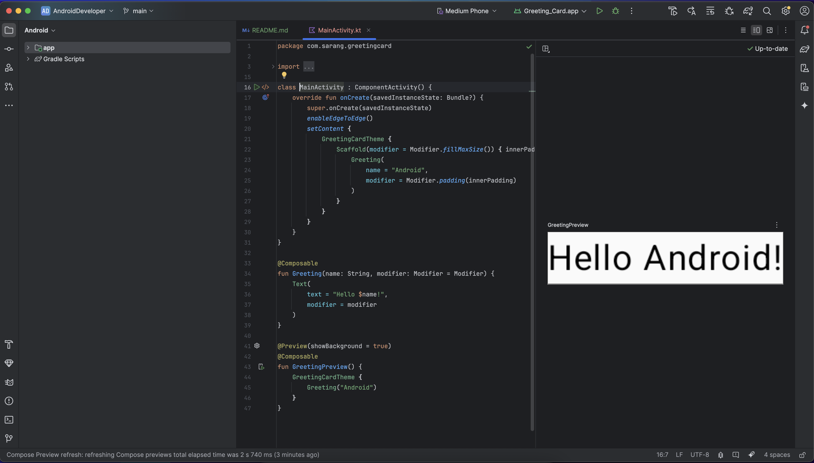
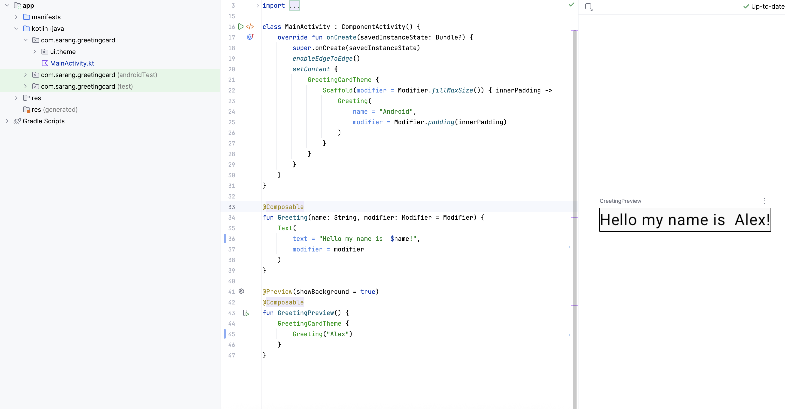

# [1. Before you begin](https://developer.android.com/codelabs/basic-android-kotlin-compose-first-app?continue=https%3A%2F%2Fdeveloper.android.com%2Fcourses%2Fpathways%2Fandroid-basics-compose-unit-1-pathway-2%23codelab-https%3A%2F%2Fdeveloper.android.com%2Fcodelabs%2Fbasic-android-kotlin-compose-first-app#0)
```
1. Before you begin

- 안드로이드 스튜디오 설치. 사양 확인
- 안드로이드 스튜디오에서 제공하는 탬플릿으로 첫 앱 만들기
- 코틀린과 Jetpack으로 앱 커스터마이즈 하기
- 안드로이드 스튜디오가 업데이트 될 때마다 UI가 조금씩 바뀌어 튜토리얼과 디자인지 좀 다른 수 있지만 괜찮음.

전제 조건
- 코틀린 지식

필요 한 것
- 최신버전 안드로이드 스튜디오

무엇을 배울 것인가?
- 안드로이드 스튜디오에서 앱 생성
- 안드로이드 Preview 도구와 함께 앱 실행
- 코틀린으로 text 업데이트
- Jetpack Compose로 UI 업데이트 방법

무엇을 빌드?
- 당신을 소개하는 앱
```

안드로이드 스튜디오는 설치되어 있다.<br>
다음장으로 넘어가 보자.

# [2. Create a project using the template](https://developer.android.com/codelabs/basic-android-kotlin-compose-first-app?continue=https%3A%2F%2Fdeveloper.android.com%2Fcourses%2Fpathways%2Fandroid-basics-compose-unit-1-pathway-2%23codelab-https%3A%2F%2Fdeveloper.android.com%2Fcodelabs%2Fbasic-android-kotlin-compose-first-app#1)

```
안드로이드 스튜디오에선 프로젝트 탬플릿은 (특정 타입의 앱을 위한 청사진을 제공하는 안드로이드) 프로젝트 이다.
'템플릿은 프로젝트의 구조'와 '안드로이드 스튜디오가 프로젝트를 빌드하는데 필요로 하는 파일'을 생성한다
선택한 탬플릿은 빨리 개발할 수 있도록 '시작 코드'를 제공.

- Phone and Tablet 선택
- Empty Activity 선택
- Name: Greeting Card
- Package name: com.example.greetingcard
- Save location : 원하는 위치
- API 24: Android 7.0 (Nougat)
- MainActivity 이동
- Click Split
- 프로젝트 개발 화면
    - 좌측 프로젝트 뷰 - 프로젝트 파일 및 폴더
    - 중앙 코드 뷰 - 코드를 수정하는 영역
    - 우측 디자인 뷰 - 앱의 디자인을 미리 볼 수 있는 영역
- Build & Refresh를 누르면 미리보기 볼 수 있음.
```
어렵지 않게 단계별로 진행할 수 있었다.



# [3. Find project files](https://developer.android.com/codelabs/basic-android-kotlin-compose-first-app?continue=https%3A%2F%2Fdeveloper.android.com%2Fcourses%2Fpathways%2Fandroid-basics-compose-unit-1-pathway-2%23codelab-https%3A%2F%2Fdeveloper.android.com%2Fcodelabs%2Fbasic-android-kotlin-compose-first-app#2)
```
파일 구조와 친해져 보자.

- 파일 탭을 보면 파일과 폴더를 볼 수 있다.
- 최초 생성시 설정한 패키지명의 폴더를 볼 수 있다.
- 패키지는 코드가 위치해 있는 폴더이다.
- 인드로이드 스튜디오는 패키지의 여러 세트들을 프로젝트 폴더로 구성한다.

드롭다운을 클릭하여 하위 파일 및 폴더를 봐보자
- 파일 구성들의 표준 구조를 볼 수 있다. 
- 코드를 작성할 때 유용. 쉽게 파일에 접근할 수 있음.
- 하지만 처음엔 일반적인 윈도우의 트리구조와 달라 햇갈릴 수 있다.
- 상단에 파일 구조를 보여주는 방법을 선택할 수 있어 기존 윈도우 트리 형식으로 보고싶다면 Project Source Files 선택한다.

```
폴더 보기 방식을 Project로 하면 일반적인 IDE에서 제공하는 방식으로 볼 수 있다.
Android를 선택하면 안드로이드에서 권장하는 방식으로 파일 폴더 트리를 보여준다.

# [4. Update the text](https://developer.android.com/codelabs/basic-android-kotlin-compose-first-app?continue=https%3A%2F%2Fdeveloper.android.com%2Fcourses%2Fpathways%2Fandroid-basics-compose-unit-1-pathway-2%23codelab-https%3A%2F%2Fdeveloper.android.com%2Fcodelabs%2Fbasic-android-kotlin-compose-first-app#3)

```
환영 카드를 만들어 보자!
- MainActivity.kt로 이동
- onCreate() 나 setContent() 같은 자동으로 생성된 코드를 볼 수 있다.
note: 함수는 특정 기능을 수행하는 프로그램의 조각이다.

- onCreate() 함수는 안드로이드 앱의 '진입점(entry point)' 이다.
- onCreate()는 또한 UI를 빌드하기 위해 다른 함수들을 호출한다.
- 코틀린과 같은 프로그램에선 main() 이 진입점 이라면 안드로이드 앱에선 onCreate() 가 진입점 이다.
- 모든 @Composable 어노테이션이 붙은 함수들은 setContent()에서 호출 할 수 있다.
- 또는 @Composable 함수에서 다른 Composable 함수를 호출할 수 있다.
- 어노테이션은 코틀린 컴파일러에 UI 생성을 위한 컴포즈 함수라는 것을 말해준다.

Note: 컴파일러는 작성한 코드를 라인 단위로 가져다 컴퓨터가 해석할 수 있게 해석한다.
이 단계를 코드를 컴파일 한다고 말한다.

Greeting() 함수를 보자
- Composable 함수이다.
- @Composable 어노테이션 이 상단에 있는것을 볼 수 있다.
- 어떤 input을 가져다. UI를 그린다.

composable 함수의 3가지 특징
1. @Composable 어노테이션을 붙인다.
2. 함수의 첫자가 대문자이다.
3. return 이 없다.   


@Composable
fun Greeting(name: String, modifier: Modifier = Modifier) {
    Text(
        text = "Hello $name!",
        modifier = modifier
    )
}

Greeting 함수는 이름을 입력받아 표시한다.

@Composable 위에 @Preview를 붙이면 미리보기를 볼 수 있다.
showBackground로 배경을 설정할 수 있다.

```


